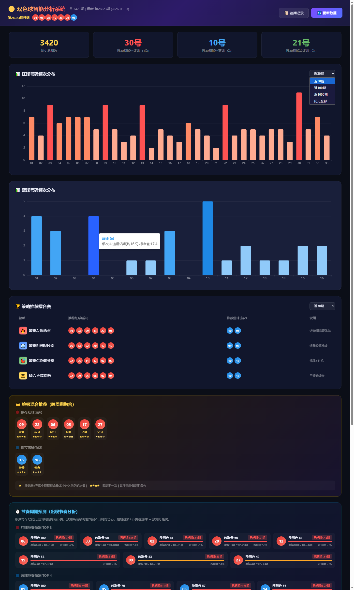
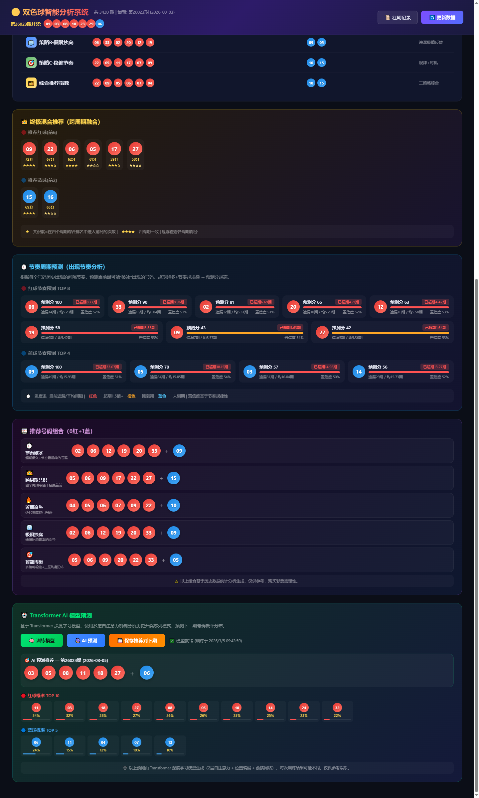
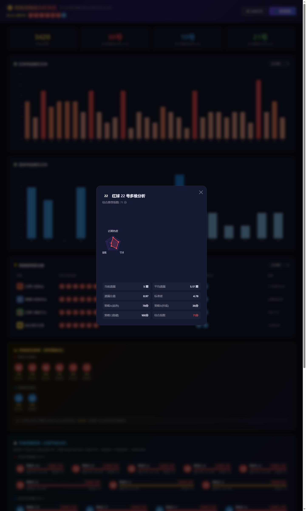
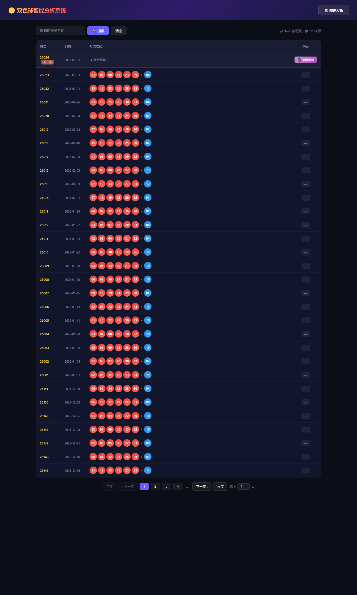
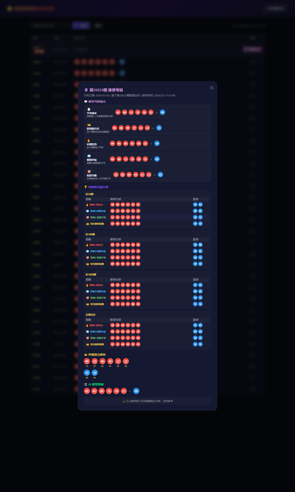

# 🎱 双色球智能分析系统

一个基于 Node.js 的中国福利彩票双色球数据分析 Web 应用。集成多维度统计分析、多策略推荐引擎和 Transformer 深度学习预测，提供可视化的号码频次、冷热分析和智能选号参考。

> ⚠️ 本系统仅用于数据分析学习和技术研究，彩票具有随机性，系统输出不构成任何投注建议。购买彩票需理性。

---

## 📸 界面预览

| 频次统计 & 策略擂台赛 & 混合推荐 | 推荐组合 & AI 预测 |
|:---:|:---:|
|  |  |

| 号码多维分析弹窗（雷达图） | 历史开奖记录 | 推荐数据回溯 |
|:---:|:---:|:---:|
|  |  |  |

---

## ✨ 功能特性

### 📊 数据采集与管理
- **自动抓取** — 一键从网页抓取最新开奖数据，自动与本地数据对比并增量更新
- **CSV 导入** — 首次启动时自动导入本地历史 CSV 数据（如有）
- **历史查询** — 分页浏览完整历史开奖记录，支持按期号搜索

### 🔢 多维度统计分析
- **多周期频次统计** — 支持近 30 期 / 100 期 / 1000 期 / 全部历史四个统计窗口
- **红球 & 蓝球频次分布** — 可视化柱状图展示每个号码的出现次数
- **冷热号标记** — 直观展示高频（热号）和低频（冷号）号码
- **遗漏值分析** — 统计各号码当前遗漏期数与历史平均间隔

### 🏆 多策略推荐引擎
系统内置四大分析策略，在四个不同时间窗口下独立计算排名：

| 策略 | 描述 |
|------|------|
| 🔥 **策略 A · 追热点** | 高频优先，追踪近期热门号码 |
| 🧊 **策略 B · 极限抄底** | 遗漏极值反转，捕捉冷号回归 |
| 🎯 **策略 C · 稳健节奏** | 结合出现规律与时机预测 |
| 👑 **综合推荐指数** | 三策略加权融合的综合评分 |

### 👑 终极混合推荐（跨周期融合）
- 将四个周期（30/100/1000/全部）的综合排名进行加权融合
- 展示每个推荐号码的综合得分与跨周期共识度（★ 评级）
- 悬浮可查看各周期的独立得分

### ⏱️ 节奏周期预测
- 分析每个号码的历史出现间隔，计算其"出现节奏"
- 标记已超期、即将到期的号码
- 基于遗漏比热力条直观展示预测强度

### 🎰 推荐号码组合
自动生成 5 组不同策略的 6 红 + 1 蓝完整号码组合：
- 节奏预测型、跨周期共识型、近期热号型、极限冷号型、智能均衡型

### 🤖 Transformer AI 模型预测
- 基于 **TensorFlow.js** 实现的 Transformer 自注意力模型
- 使用 WASM 后端（支持 SIMD 加速），无需 GPU
- 可在浏览器端一键训练 & 预测
- 输出红球 / 蓝球概率分布 TOP 排名
- 模型自动保存，下次启动可直接加载使用

### 💾 推荐数据保存与回溯
- 每次分析后自动保存推荐至下一期
- 支持手动一键保存当前所有推荐（含 AI 预测）
- 历史记录页可查看每期保存的完整推荐数据

---

## 🛠️ 技术栈

| 技术 | 用途 |
|------|------|
| **Node.js + Express** | 后端服务与 API |
| **TensorFlow.js** | Transformer 深度学习模型 |
| **Axios + Cheerio** | 网页数据抓取与解析 |
| **原生 HTML/CSS/JS** | 前端界面（暗色主题） |

---

## 🚀 快速开始

### 环境要求
- **Node.js** ≥ 16.x
- **npm** ≥ 8.x

### 安装与启动

```bash
# 1. 克隆仓库
git clone https://github.com/skyloveyu/ssq-analysis-system.git
cd ssq-analysis-system

# 2. 安装依赖
npm install

# 3. 启动服务
npm start
```

启动后终端会显示：
```
🎱 ============================================
🎱  双色球智能分析系统已启动
🎱  本机访问: http://localhost:3001
🎱  局域网:   http://192.168.x.x:3001
🎱 ============================================
```

### 使用方式

1. 浏览器访问 `http://localhost:3001`
2. 点击 **🔄 更新数据** 按钮抓取最新开奖数据
3. 系统自动完成分析并展示所有统计图表和推荐
4. 点击 **📜 往期记录** 查看历史开奖与推荐回溯
5. 在 AI 模型区域点击 **🧠 训练模型** → 训练完成后点击 **🎯 预测下期**

---

## 📁 项目结构

```
├── server.js                  # 主服务（Express API + 数据管理）
├── analyzer.js                # 多维度分析引擎
├── transformer_predictor.js   # Transformer AI 模型
├── package.json               # 项目配置与依赖
├── public/
│   ├── index.html             # 主页（分析仪表盘）
│   └── history.html           # 历史记录页
└── data/                      # 运行时数据（自动生成，已 gitignore）
    ├── lottery_data.json       # 彩票开奖数据
    ├── analyzed_result.json    # 分析结果缓存
    ├── recommendations.json   # 推荐数据存档
    └── model/                 # AI 模型权重
```

---

## 📡 API 接口

| 方法 | 路径 | 说明 |
|------|------|------|
| GET | `/api/analyzed` | 获取分析结果 |
| GET | `/api/status` | 获取数据概览 |
| POST | `/api/update` | 抓取并更新数据 |
| POST | `/api/reanalyze` | 仅重新分析 |
| GET | `/api/history?page=1` | 历史记录分页查询 |
| GET | `/api/recommendations/list` | 推荐期号列表 |
| GET | `/api/recommendations/:issue` | 查询指定期推荐 |
| POST | `/api/recommendations/save` | 保存当前推荐 |
| GET | `/api/ai/status` | AI 模型训练状态 |
| POST | `/api/ai/train` | 开始训练模型 |
| POST | `/api/ai/predict` | AI 预测下期 |

---

## 📝 License

MIT
